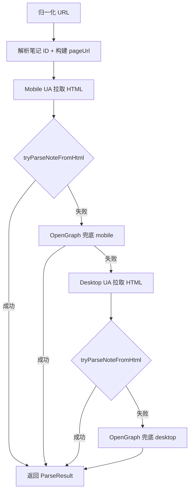

# 小红书资源解析优先级

本文档描述 **作品下载助手** 当前如何从分享链接解析可下载资源，以及 URL 选取、合并、去重、下载时的优先级。实现以源码为准：

| 模块 | 路径 |
|------|------|
| 主解析器 | `app/src/main/java/com/taoguo/post_saver/parser/XiaohongshuParser.kt` |
| 图片 URL | `app/src/main/java/com/taoguo/post_saver/parser/XhsImageUrlResolver.kt` |
| 下载 | `app/src/main/java/com/taoguo/post_saver/download/MediaDownloader.kt` |

---

## 1. 整体流程（分享链接 → 媒体列表）

1. `UrlNormalizer.normalize`：补全协议、`http` → `https`（xhscdn / xiaohongshu 等域名）。
2. `resolveFinalUrl`：短链跟随重定向；若 URL 已含笔记 ID，则 `buildNotePageUrl`（保留 `xsec_token`、`xsec_source`）。
3. **先 Mobile UA，再 Desktop UA**；每种 UA 下按下一节的数据源优先级解析。

---

## 2. 页面数据源优先级

在同一 HTML 内，`tryParseNoteFromHtml` 按以下顺序组合结果：

| 优先级 | 来源 | 方法 | 说明 |
|--------|------|------|------|
| 1 | `window.__INITIAL_STATE__` / `__INITIAL_SSR_STATE__` | `parseInitialState` | 主路径：从笔记 JSON 的 `imageList` 构建媒体 |
| 2 | HTML 片段中的 `urlDefault` | `parseImagesFromHtml` | 仅在 INITIAL_STATE 与 HTML 兜底**同时存在**时，与主路径 **合并** |
| 合并规则 | 两路都有图 | `mergeParseResults` | 见第 5 节 |
| 仅一路 | 只有 state 或只有 html | 直接返回该路结果 | 不合并 |

若 `tryParseNoteFromHtml` 失败，再使用 **OpenGraph**（`og:video` 优先于 `og:image`，通常只有 1 条资源，质量最低）。

---

## 3. 笔记对象（`note`）查找优先级

`parseInitialState` 在状态 JSON 中按顺序查找笔记 payload（`isNotePayload`：含 `imageList` / `image_list` / `images` / `video` / `desc`）：

1. `noteData.data.noteData`
2. `note.noteDetailMap[noteId].note`，否则 `noteDetailMap[noteId]` 自身
3. `noteDetailMap` 下任意 key 的 `note` 或 wrapper（**不校验 noteId**，取第一个像笔记的对象）
4. `findNoteRecursive`：按 `noteId` / `id` 递归匹配

---

## 4. 图片列表字段优先级

`resolveImageList(note)` 取第一个非空数组：

1. `imageList`
2. `image_list`
3. `images`

按数组 **下标顺序** 逐张处理；`pickImageUrl` 失败则 **跳过** 该张（不占位）。

---

## 5. 单张图片 URL 选取（`pickImageUrl`）

对 `imageList` 中每个 JSONObject，按 **两阶段** 选 URL。

### 5.1 阶段一：详情场景（直接返回，不再打分）

在 `infoList` / `info_list` 中，**按数组顺序** 扫描，命中即返回该条 `url`：

| 优先级 | `imageScene` |
|--------|----------------|
| 1 | `H5_DTL` |
| 2 | `WB_DFT` |
| 3 | `WB_DFT_HD` |

典型：`H5_DTL` 对应 `!h5_1080jpg`（分享页详情图，优先于预览）。

### 5.2 阶段二：候选池 + 打分（无详情场景时）

收集候选后，由 `XhsImageUrlResolver.pickBestDownloadUrl` 选最高分：

**候选来源（全部加入池）：**

1. `infoList` / `info_list` 中每一项的 `url`（含 `H5_PRV` 等）
2. 字段：`urlDefault`、`url_default`、`url`、`original`、`livePhoto`
3. 字段：`urlPre`、`url_pre`（预览，优先级低于上组）

**打分规则（`downloadUrlRank`，分数高者优先）：**

| 条件 | 加分 |
|------|------|
| 非预览 URL（见下） | +100 |
| 含 `h5_1080` | +80 |
| 含 `webp_mw` | +50 |
| 含 `WB_DFT` | +40 |
| 含 `ci.xiaohongshu.com` | +30 |
| 含 `!style_` | **-60** |
| URL 长度（上限 200） | +length |

**视为预览（`isPreviewUrl`）的路径：**

- `webp_prv`
- `!nc_n_webp_prv`
- `!style_`（H5 预览样式，易带平台水印）

选中后还会执行 `upgradePreviewToHd`（`webp_prv` → `webp_mw` 等）。

### 5.3 写入 `MediaItem`

- `url`：`resolveDownloadUrl(pick 结果)`（见第 6 节）
- `previewUrl`：阶段一/二选中的原始 URL（未再 resolve）
- `referer`：`https://www.xiaohongshu.com/`

---

## 6. 解析阶段下载 URL（`resolveDownloadUrl`）

对任意一条原始图片 URL：

1. `getDownloadCandidates(url)` 生成候选集（`LinkedHashSet` 保序）：
   1. `upgradePreviewToHd(url)` 并 `normalize`
   2. 若与上不同：原始 `url` 的 `normalize`
   3. `buildCiDownloadUrl(url)` → `https://ci.xiaohongshu.com/{path}?imageView2/format/png`
   4. `buildCiDownloadUrl(upgraded)`
2. `pickBestDownloadUrl(candidates)`：对候选 **打分**（第 5.2 节），取最高作为列表展示的 `MediaItem.url`
3. 若无候选：`upgradePreviewToHd(url)`

`ci` 路径从 `xhscdn.com/{hash}/{path}!...` 提取 `path`；无法匹配则无 ci 候选。

---

## 7. INITIAL_STATE 与 HTML 合并（`mergeParseResults`）

当 `parseInitialState` 与 `parseImagesFromHtml` **都成功** 时：

1. **顺序**：先吸收 `stateResult` 的图片，再吸收 `htmlResult` 的图片。
2. **同图判定键**：`imageIdentityKey(url)`，依次为：
   - 路径片段：`notes_pre_post/`、`note_pre_post_uhdr/`、`spectrum/` + fileId
   - 否则 `/spectrum/{id}`（`spectrumKey`）
   - 否则完整 URL 字符串
3. **同键多条**：`preferBetter` 保留打分更高的 `url`；`previewUrl` 尽量保留已有。
4. **输出顺序**：按键 **首次出现** 顺序（通常与 state 的 `imageList` 顺序一致）。
5. 视频：两路视频合并后按 `url` **去重**，附在图片列表之后。

HTML 兜底只匹配正则：`"urlDefault"` / `"url_default"`（**不匹配** `urlPre`、裸 `url`、infoList）。

---

## 8. 列表去重与终态（`finalizeMediaItems`）

1. **图片去重**：`dedupeImageItems` 按 `imageIdentityKey`（同上），**保留首次出现**，不按 spectrum 合并不同图。
2. **再次 resolve**：对去重后每条图片的 `url` 再执行一次 `resolveDownloadUrl`（可能与构建时略有不同）。
3. **文件名**：`xhs_{noteId}_{index}.jpg`，index 从 1 递增。
4. **顺序**：所有图片在前，视频在后。

---

## 9. 实际下载时的 URL 尝试顺序（`MediaDownloader`）

列表里展示的 `MediaItem.url` 已是打分后的「首选」；**下载失败时**按候选依次重试（仅 `xhscdn` 图片）：

| 尝试顺序 | 候选 |
|----------|------|
| 1 | `upgradePreviewToHd(item.url)`（https） |
| 2 | 原始 `item.url`（若与 1 不同） |
| 3 | `ci.xiaohongshu.com/...`（由 item.url 构建） |
| 4 | `ci`（由 upgraded 构建） |

**注意：** 若第 1 个候选 HTTP 200 但返回的是 **带水印预览图**，不会自动再试 `ci`。无水印依赖解析阶段是否把 `item.url` 选成高分详情链 / ci。

非 xhscdn 图片：仅 `normalize(item.url)` 一次。

请求头：`User-Agent`（Chrome Mobile）、`Referer`（笔记页或按域名推断）。

---

## 10. 视频 URL 优先级（`pickVideoUrl`）

1. `video.media.stream`：`h265` → `h264` → `av1`（各取首个非空 `masterUrl`）
2. `video.media` 字符串（http 开头）
3. `video.consumer.originVideoKey` → `https://sns-video-bd.xhscdn.com/{key}`
4. 封面：`video.cover` 或 `cover.urlDefault`（仅 `previewUrl`）

---

## 11. 笔记 ID 与页面 URL

**笔记 ID 正则（命中即返回）：**

- `/explore/{24位hex}`
- `/discovery/item/{24位hex}`
- `/item/{24位hex}`
- `?noteId=` / `?note_id=`

**页面 URL：**

- 若已在 `/explore/{id}` 或 `/discovery/item/{id}` 且带 `xsec_token` → 保留原 URL
- 否则 → `https://www.xiaohongshu.com/explore/{noteId}?xsec_token=...&xsec_source=...`（从原链提取）

---

## 12. 与调试 JSON 的关系

解析成功或失败会写入 `ParseDebugStore`（主界面「查看解析 JSON」）：

- `parseSource`：`mobileHtml` / `desktopHtml` / `mobileOpenGraph` / `desktopOpenGraph`
- `note` / `initialState` / `htmlImageUrls`：便于对照页面 JSON
- `parseResult.mediaItems`：经上述优先级处理后的 **最终列表**

---

## 13. 已知限制（选 URL 时需注意）

| 现象 | 原因 |
|------|------|
| 图中有小红书水印 | 常下载到 `!style_` / H5_PRV 或分享页低清链；应确保阶段一命中 `H5_DTL` 或高分 `h5_1080` |
| 条数少于 `imageList` 长度 | `pickImageUrl` 返回 null 的项被 `continue` 跳过 |
| OpenGraph 仅 1 张图 | 主路径失败后的最后兜底 |
| `ci` 未生效 | 解析首选已是 webpic 且下载 HTTP 成功时，不会走到 ci 候选 |

---

## 14. 变更时请同步更新

调整以下任一逻辑时，请同步更新本文档：

- `XiaohongshuParser.parse` / `tryParseNoteFromHtml` / `mergeParseResults` / `pickImageUrl`
- `XhsImageUrlResolver.downloadUrlRank` / `getDownloadCandidates` / `isPreviewUrl`
- `MediaDownloader.resolveDownloadCandidates`
